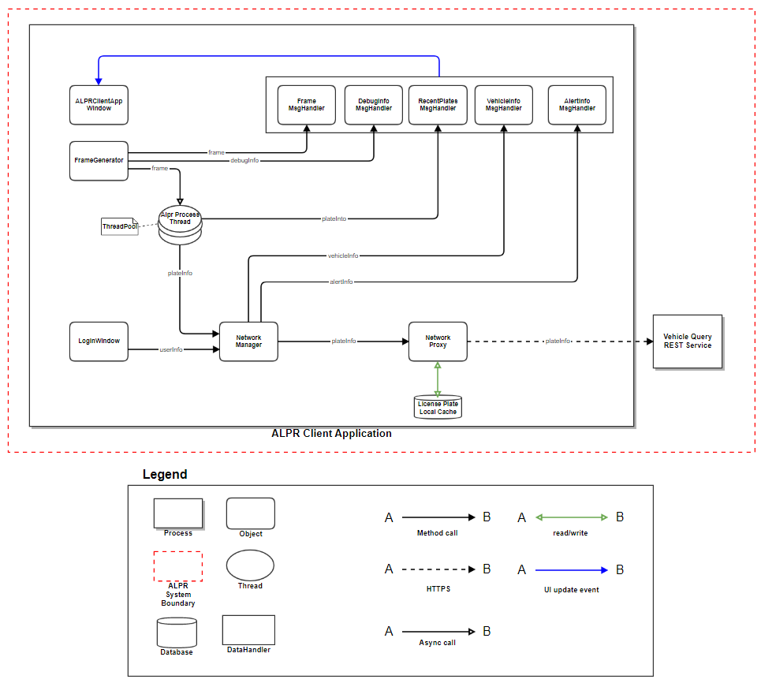
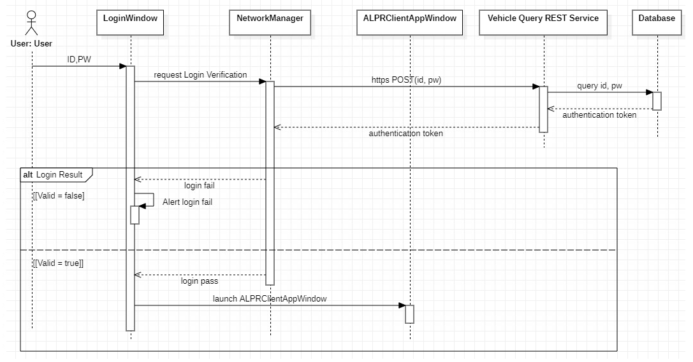
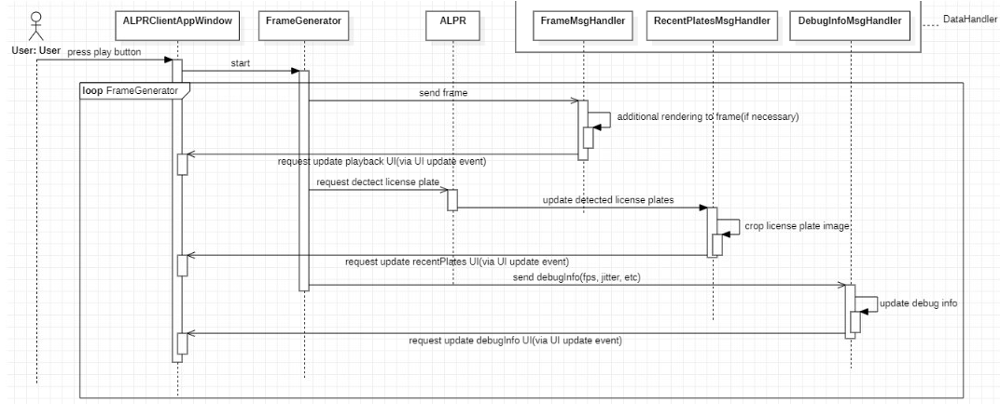
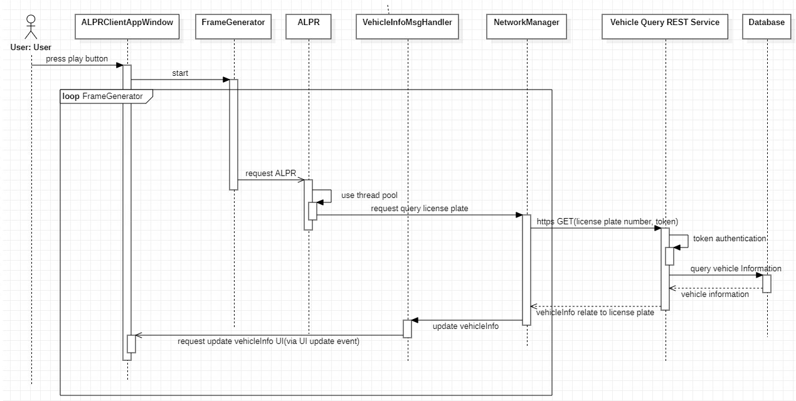
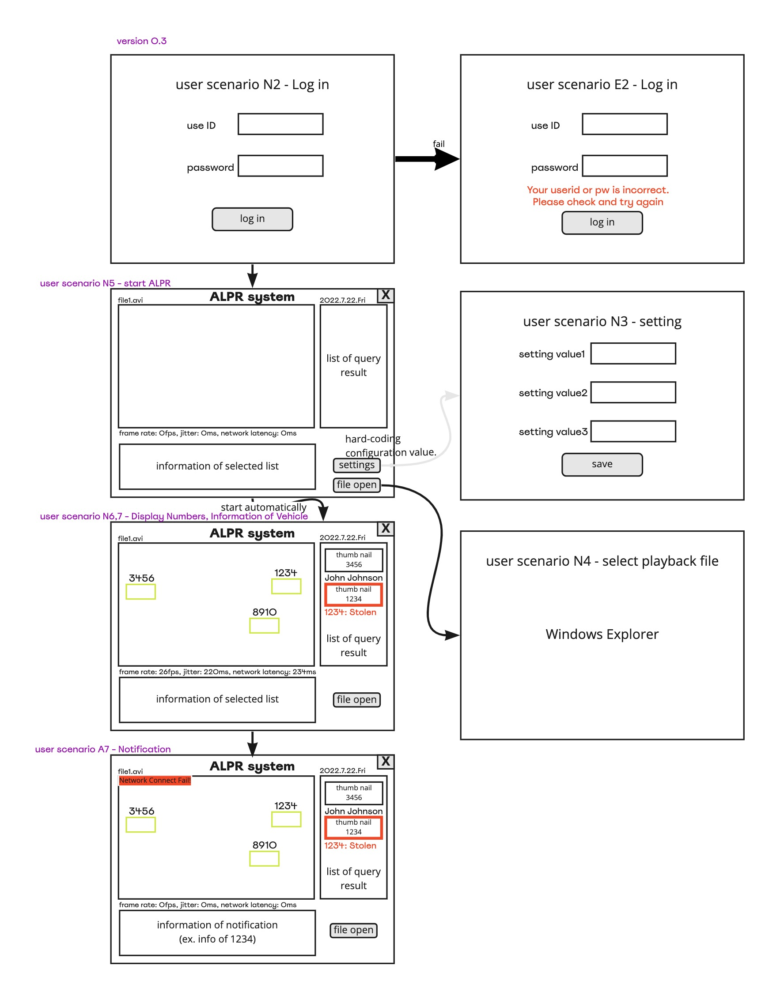

# ALPR Client Application Runtime View

## Element Catalog 

### ALPR Process Thread
- Threads in thread pool. Frame Generator sends each frames to single thread in the pool.

### License Plate Local Cache
- It stores vehicle detail information from Vehicle Query service

### Network Proxy
- It hides existence of local cache to NetworkManager

### Handlers
- Data to update UI are given to each handlers.
- Each handlers send signal to main window to update UI.

## Behavior 
### Login Sequence Diagram

### User Interface Update Sequence Diagram

### Vehicle Query Sequence Diagram

### User Interface Scenario

## ADRs
- [ADR4 : Introduce Concurrency](ADR4.md)
- [ADR5 : Proxy pattern for local cache](ADR5.md)

## Related Views 
- [ALPR Client Module Uses View](../Client%20Module%20Uses%20View/Client%20Module%20Uses%20View.md)
- [ALPR System Deployment View](../System%20Deployment%20View/System%20Deployment%20View.md)
