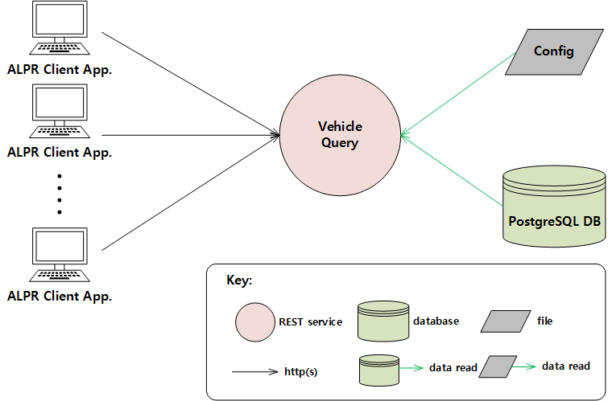

# Vehicle Query REST Service Runtime View

## Element Catalog 

### Vehicle Query
- It provides REST endpoint for vehicle detail information query
- It also provides REST endpoint for authentiation

### PostgreSQL DB
- Local database to store vehicle detail information
- User information and authentication tokens also stored in this DB
- Supports partial match

### Config
- Some configurable properties are stored in this file

## Behavior 
N/A

## ADRs
- [ADR6: Using Django](ADR6.md)
- [ADR11: Using Postgre SQL](ADR11.md)

## Related Views 
[System Deployment View](../System%20Deployment%20View/System%20Deployment%20View.md)
