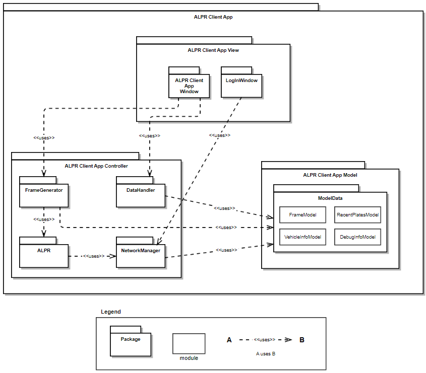

# ALPR Client Application Module Uses View

## Element Catalog 

### ALPR Client App Window
- Receives input from the user
- Updates the view when the model is updated

### Login Window
- Receives login input from a user
- Requests login to NetworkManager

### FrameGenerator
- Extracts frames from selected video file

### NetworkManager
- Requests vehicle query and login to the server

### DataHandler
- Requests UI update when the data is updated

## Behavior 
N/A

## ADRs
[ADR1]()

## Related Views 
[tip #7](seven-tips-design-diagrams.md).